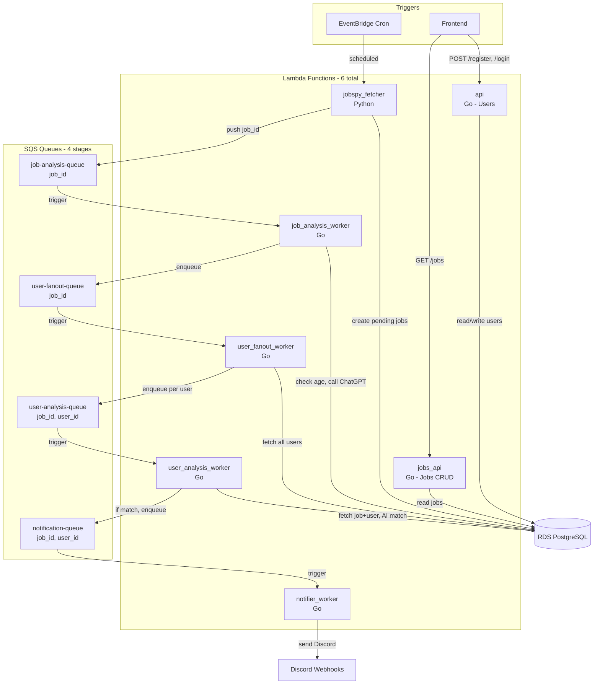

# JobPing Architecture

## Overview

JobPing uses a **4-stage event-driven pipeline** with SQS queues connecting Lambda workers. Each stage has a single responsibility, enabling independent scaling and retryability.



## 4-Stage Pipeline

### Stage 1: Job Analysis Worker
**Queue:** `job-analysis-queue`  
**Message:** `{ "job_id": "uuid" }`  
**Lambda:** `cmd/workers/job_analysis/main.go`

**Responsibilities:**
1. Fetch job by `job_id` from RDS
2. Check if `company_info` exists and `company_info_updated_at` < 6 months old
3. If fresh → skip, else:
   - Call ChatGPT API to research company
   - Save `company_info` and `company_info_updated_at` to DB
4. Enqueue `{ "job_id" }` to `user-fanout-queue`

**Design Rules:**
- One job per message
- No user logic
- May call AI (ChatGPT)
- Fully retryable

### Stage 2: User Fanout Worker
**Queue:** `user-fanout-queue`  
**Message:** `{ "job_id": "uuid" }`  
**Lambda:** `cmd/workers/user_fanout/main.go`

**Responsibilities:**
1. Fetch all users with AI prompts (can be ~1000)
2. For each user, enqueue `{ "job_id": "uuid", "user_id": "uuid" }` to `user-analysis-queue`
3. No AI calls, just fan-out

**Design Rules:**
- Fast execution
- Looping users is allowed here
- Purpose is fan-out only
- No AI, no business logic

### Stage 3: User Analysis Worker
**Queue:** `user-analysis-queue`  
**Message:** `{ "job_id": "uuid", "user_id": "uuid" }`  
**Lambda:** `cmd/workers/user_analysis/main.go`

**Responsibilities:**
1. Fetch job + company_info from RDS
2. Fetch user + AI prompt from RDS
3. Run ChatGPT AI to determine if user matches job
4. If match (score >= threshold):
   - Create/update `user_job_matches` record with:
     - `score`: matching score (0-100)
     - `analysis`: AI analysis (JSONB with explanation, pros, cons, etc.)
   - Enqueue `{ "job_id": "uuid", "user_id": "uuid" }` to `notification-queue`
5. If no match: do nothing

**Design Rules:**
- One message = one AI call
- No loops
- Fully retryable per user
- Slow / expensive step
- Stores analysis in `user_job_matches` table (queryable by user_id + job_id)

### Stage 4: Notification Worker
**Queue:** `notification-queue`  
**Message:** `{ "job_id": "uuid", "user_id": "uuid" }`  
**Lambda:** `cmd/workers/notifier/main.go`

**Responsibilities:**
1. Fetch user from RDS
2. Fetch job from RDS
3. Fetch match from `user_job_matches` table using `job_id + user_id`
   - This contains the AI analysis and matching score
4. **For Testing:** Create notification event in `notifications` table for frontend to query
5. **Future:** Send Discord notification (to be implemented)
6. Mark match as `notified = true` in `user_job_matches`

**Design Rules:**
- One message = one user notification
- No fan-out
- No AI
- Fetches AI analysis from `user_job_matches` (not regenerated)
- Retry on failure
- DLQ on permanent failure

## File Structure

```
backend/
├── cmd/
│   ├── api/                          # User management Lambda
│   │   └── main.go                   # API Gateway → chi router (users only)
│   │
│   ├── jobs_api/                     # Job CRUD Lambda
│   │   └── main.go                   # API Gateway → chi router (jobs only)
│   │
│   └── workers/
│       ├── job_analysis/             # Stage 1: Company research
│       │   └── main.go               # SQS → job-analysis-queue
│       │
│       ├── user_fanout/              # Stage 2: Fan-out to users
│       │   └── main.go               # SQS → user-fanout-queue
│       │
│       ├── user_analysis/            # Stage 3: AI matching
│       │   └── main.go               # SQS → user-analysis-queue
│       │
│       └── notifier/                  # Stage 4: Notifications
│           └── main.go               # SQS → notification-queue
│
├── internal/
│   ├── app/
│   │   ├── api.go                    # Wire user API dependencies
│   │   ├── jobs_api.go               # Wire jobs API dependencies
│   │   ├── job_analysis.go           # Wire job analysis worker
│   │   ├── user_fanout.go            # Wire user fanout worker
│   │   ├── user_analysis.go          # Wire user analysis worker
│   │   └── notifier.go               # Wire notification worker
│   │
│   ├── features/
│   │   ├── user/                     # User feature (unchanged)
│   │   │   ├── handler/
│   │   │   │   ├── http.go
│   │   │   │   └── middleware.go
│   │   │   ├── service/
│   │   │   │   └── user_service.go
│   │   │   ├── repository/
│   │   │   │   └── user_repository.go
│   │   │   └── model/
│   │   │       └── user.go
│   │   │
│   │   ├── job/                      # CRUD ONLY - No AI logic
│   │   │   ├── handler/
│   │   │   │   └── http.go           # GET /api/jobs (read only)
│   │   │   ├── repository/
│   │   │   │   └── job_repository.go # Database operations
│   │   │   ├── model/
│   │   │   │   └── job.go            # Job data structure
│   │   │   └── module.go             # Route registration
│   │   │
│   │   ├── job_analysis/             # NEW: Company research feature
│   │   │   ├── handler/
│   │   │   │   └── sqs.go            # SQS job_id consumer
│   │   │   └── service/
│   │   │       ├── job_analysis_service.go  # Check age, call ChatGPT
│   │   │       └── ai_client.go      # ChatGPT API client
│   │   │
│   │   ├── user_fanout/               # NEW: Fan-out feature
│   │   │   ├── handler/
│   │   │   │   └── sqs.go            # SQS job_id consumer
│   │   │   └── service/
│   │   │       └── fanout_service.go # Fetch users, enqueue per user
│   │   │
│   │   ├── user_analysis/             # NEW: User matching feature
│   │   │   ├── handler/
│   │   │   │   └── sqs.go            # SQS job_id+user_id consumer
│   │   │   └── service/
│   │   │       ├── user_analysis_service.go # AI matching logic
│   │   │       └── ai_client.go      # ChatGPT API client
│   │   │
│   │   └── notification/              # NEW: Notification feature
│   │       ├── handler/
│   │       │   ├── sqs.go            # SQS job_id+user_id consumer
│   │       │   └── http.go           # GET /api/notifications (for testing)
│   │       ├── service/
│   │       │   └── notification_service.go  # Create notification events
│   │       └── repository/
│   │           └── notification_repository.go  # Store notification events
│   │
│   ├── config/
│   │   └── config.go
│   │
│   ├── database/
│   │   ├── db.go
│   │   ├── migrate.go
│   │   └── migrations/
│   │       ├── 000001_init_schema.up.sql
│   │       ├── 000002_add_jobs_table.up.sql
│   │       ├── 000003_add_user_prompts_and_matches.up.sql
│   │       ├── 000004_add_company_info_timestamp.up.sql  # NEW
│   │       └── 000005_add_notifications_table.up.sql    # NEW - for testing
│   │
│   └── server/
│       └── router.go

python_workers/
├── jobspy_fetcher/                    # Job scraping (Python)
│   ├── handler.py                     # Creates jobs in RDS, sends job_id to Q1
│   ├── requirements.txt
│   └── Dockerfile
│
└── shared/
    └── sqs_client.py

infra/terraform/
├── api_gateway.tf                     # API Gateway routes
├── lambda.tf                          # All Lambda functions
├── sqs.tf                             # 4 SQS queues + triggers
├── rds.tf                             # PostgreSQL database
└── eventbridge.tf                     # Scheduled triggers
```

## Message Formats

### Stage 1: Job Analysis Queue
```json
{
  "job_id": "550e8400-e29b-41d4-a716-446655440000"
}
```

### Stage 2: User Fanout Queue
```json
{
  "job_id": "550e8400-e29b-41d4-a716-446655440000"
}
```

### Stage 3: User Analysis Queue
```json
{
  "job_id": "550e8400-e29b-41d4-a716-446655440000",
  "user_id": "660e8400-e29b-41d4-a716-446655440001"
}
```

### Stage 4: Notification Queue
```json
{
  "job_id": "550e8400-e29b-41d4-a716-446655440000",
  "user_id": "660e8400-e29b-41d4-a716-446655440001"
}
```

## Data Flow

1. **Job Fetching (Python)**
   - EventBridge cron triggers `jobspy_fetcher` Lambda
   - Scrapes jobs from job boards
   - Creates job records in RDS with `status='pending'`
   - Sends `{ "job_id" }` to `job-analysis-queue`

2. **Job Analysis (Stage 1)**
   - `job_analysis_worker` triggered by SQS
   - Checks if company info is fresh (< 6 months)
   - If stale, calls ChatGPT to research company
   - Saves company info to RDS
   - Sends `{ "job_id" }` to `user-fanout-queue`

3. **User Fanout (Stage 2)**
   - `user_fanout_worker` triggered by SQS
   - Fetches all users with AI prompts (~1000 users)
   - For each user, sends `{ "job_id", "user_id" }` to `user-analysis-queue`
   - No AI calls, just distribution

4. **User Analysis (Stage 3)**
   - `user_analysis_worker` triggered by SQS (one message per user)
   - Fetches job + company_info from RDS
   - Fetches user + AI prompt from RDS
   - Calls ChatGPT to determine match score
   - If match: creates match record, sends to `notification-queue`
   - If no match: does nothing

5. **Notification (Stage 4)**
   - `notifier_worker` triggered by SQS
   - Fetches user and job from RDS
   - Fetches match from `user_job_matches` table using `job_id + user_id`
     - Contains: `score`, `analysis` (AI-generated explanation)
   - **For Testing:** Creates notification event in `notifications` table
     - Includes: job details, user details, AI analysis from match
   - **Future:** Sends Discord notification (to be implemented)
   - Marks match as `notified = true` in `user_job_matches`

6. **User Views Jobs**
   - Frontend calls `GET /api/jobs`
   - `jobs_api` Lambda reads processed jobs from RDS
   - Returns jobs with AI analysis

7. **User Views Notifications (Testing)**
   - Frontend calls `GET /api/notifications`
   - `jobs_api` Lambda reads from `notifications` table
   - Returns notification events with:
     - Job details (title, company, URL)
     - User details
     - AI analysis (from `user_job_matches`)
     - Matching score

## Feature Responsibilities

### `job/` Feature (CRUD Only)
- **Repository**: Database operations (Create, Read, Update, Delete)
- **Model**: Job data structure
- **Handler**: `GET /api/jobs` - list processed jobs
- **No AI logic, no SQS handling, no business logic**

### `job_analysis/` Feature
- **Service**: 
  - `AnalyzeJob(ctx, jobID)` - check age, call ChatGPT, save company_info
  - Enqueue to user-fanout-queue
- **Handler**: SQS consumer for `job-analysis-queue`
- **Dependencies**: Uses `job/repository` to read/write jobs

### `user_fanout/` Feature
- **Service**: 
  - `FanoutToUsers(ctx, jobID)` - fetch all users, enqueue per user
- **Handler**: SQS consumer for `user-fanout-queue`
- **Dependencies**: Uses `user/repository` to fetch users
- **No AI, just enqueueing**

### `user_analysis/` Feature
- **Service**: 
  - `AnalyzeUserMatch(ctx, jobID, userID)` - fetch job+user, call ChatGPT, create match
  - Enqueue to notification-queue if match
- **Handler**: SQS consumer for `user-analysis-queue`
- **Dependencies**: Uses `job/repository` and `user/repository`

### `notification/` Feature
- **Service**: 
  - `SendNotification(ctx, jobID, userID)` - fetch user+job+match, create notification event
  - Fetches match from `user_job_matches` using `job_id + user_id`
  - Creates notification event in `notifications` table (for testing)
  - Marks match as `notified = true`
- **Handler**: 
  - SQS consumer for `notification-queue`
  - HTTP handler: `GET /api/notifications` (for frontend testing)
- **Repository**: `notification_repository.go` - stores notification events
- **Dependencies**: 
  - Uses `user/repository` to fetch user
  - Uses `job/repository` to fetch job
  - Uses `user/repository` (UserJobMatchRepository) to fetch match analysis

## Database Schema Changes

### New Column in `jobs` Table
```sql
ALTER TABLE jobs ADD COLUMN company_info_updated_at TIMESTAMP WITH TIME ZONE;
CREATE INDEX idx_jobs_company_info_updated ON jobs(company_info_updated_at);
```

This allows checking if company info is fresh (< 6 months old) before re-analyzing.

### New `notifications` Table (for Testing)
```sql
CREATE TABLE IF NOT EXISTS notifications (
    id UUID PRIMARY KEY DEFAULT gen_random_uuid(),
    user_id UUID NOT NULL REFERENCES users(id) ON DELETE CASCADE,
    job_id UUID NOT NULL REFERENCES jobs(id) ON DELETE CASCADE,
    match_id UUID NOT NULL REFERENCES user_job_matches(id) ON DELETE CASCADE,
    job_title VARCHAR(500) NOT NULL,
    company VARCHAR(255) NOT NULL,
    job_url TEXT NOT NULL,
    matching_score INTEGER NOT NULL,
    ai_analysis JSONB NOT NULL,
    created_at TIMESTAMP WITH TIME ZONE DEFAULT NOW()
);

CREATE INDEX idx_notifications_user_id ON notifications(user_id);
CREATE INDEX idx_notifications_created_at ON notifications(created_at DESC);
```

**Purpose:** Store notification events for frontend testing. Each notification includes:
- Job details (title, company, URL)
- Matching score from `user_job_matches`
- AI analysis from `user_job_matches` (explanation, pros, cons, etc.)

**Note:** The AI analysis is fetched from `user_job_matches` table, not regenerated. This ensures consistency and avoids duplicate AI calls.

### Data Model for User-Job Matches

The `user_job_matches` table stores per-user AI analysis for each job:
- **Query Pattern:** 
  - Notification worker: `SELECT * FROM user_job_matches WHERE user_id = ? AND job_id = ?`
  - User's matches: `SELECT * FROM user_job_matches WHERE user_id = ? ORDER BY score DESC`
  - Job's matches: `SELECT * FROM user_job_matches WHERE job_id = ? ORDER BY score DESC`
- **Stored Data:**
  - `score`: Matching score (0-100)
  - `analysis`: JSONB containing AI-generated analysis
    ```json
    {
      "explanation": "Why this job matches...",
      "pros": ["Remote work", "Good salary"],
      "cons": ["Large company"],
      "recommendation": "Strong match"
    }
    ```
- **Indexes:** 
  - Both `user_id` and `job_id` are indexed for fast lookups
  - Composite unique constraint on `(user_id, job_id)` ensures one match per user-job pair
- **Design Decision:** Analysis is stored under each user-job pair, queryable by both `user_id` and `job_id`. This allows:
  - Notification worker to fetch analysis by `job_id + user_id`
  - Users to see all their matches by querying `user_id`
  - Jobs to see all matched users by querying `job_id`

## Core Design Principles

1. **One SQS queue per stage** - Clear separation of concerns
2. **One Lambda per queue** - Single responsibility
3. **Fan-out only happens by writing many SQS messages** - Scalable distribution
4. **AI is never run inside fan-out loops** - Expensive operations isolated
5. **Retries must only re-run the smallest unit of work** - Per-user retries, not per-job
6. **Domain logic lives in feature services; Lambdas are orchestration only** - Testable, maintainable

## Infrastructure

### SQS Queues (4 total)
- `job-analysis-queue` - Stage 1 input
- `user-fanout-queue` - Stage 2 input
- `user-analysis-queue` - Stage 3 input
- `notification-queue` - Stage 4 input

Each queue has:
- Dead Letter Queue (DLQ) for failed messages
- Visibility timeout appropriate for worker duration
- Long polling enabled

### Lambda Functions (6 total)
- `api` - User management (API Gateway)
- `jobs_api` - Job CRUD (API Gateway)
- `job_analysis_worker` - Stage 1 (SQS trigger)
- `user_fanout_worker` - Stage 2 (SQS trigger)
- `user_analysis_worker` - Stage 3 (SQS trigger)
- `notifier_worker` - Stage 4 (SQS trigger)

### API Gateway Routes
- `POST /api/register` → `api` Lambda
- `POST /api/login` → `api` Lambda
- `GET /api/jobs` → `jobs_api` Lambda
- `GET /api/notifications` → `jobs_api` Lambda (for testing - returns notification events)

## Local Development

### Prerequisites
- Docker & Docker Compose
- Go 1.25+
- Python 3.11+
- Node.js 18+

### Quick Start
```bash
# Start infrastructure (Postgres + LocalStack)
./scripts/local-dev.sh

# Terminal 1: Start Go backend (for local testing)
cd backend && air

# Terminal 2: Start frontend
cd frontend && npm run dev

# Terminal 3: Test Python worker
cd python_workers/jobspy_fetcher
pip install -r requirements.txt
python test_local.py
```

### URLs
| Service | URL |
|---------|-----|
| Frontend | http://localhost:5173 |
| Go Backend | http://localhost:8080 |
| LocalStack SQS | http://localhost:4566 |
| PostgreSQL | localhost:5433 |

## Environment Variables

### Go Lambdas
| Variable | Description |
|----------|-------------|
| `DATABASE_URL` | PostgreSQL connection string |
| `JWT_SECRET` | JWT signing key |
| `OPENAI_API_KEY` | OpenAI API key for ChatGPT calls |

### Python Lambda
| Variable | Description |
|----------|-------------|
| `DATABASE_URL` | PostgreSQL connection string (for job creation) |
| `SQS_QUEUE_URL` | SQS queue URL for job-analysis-queue |
| `AWS_REGION` | AWS region |

## Deployment

### Deploy Go Lambdas
```bash
./scripts/build.sh
./scripts/deploy.sh
```

### Deploy Python Lambda
```bash
./scripts/deploy-python-lambda.sh jobspy_fetcher
```

### Apply Terraform
```bash
cd infra/terraform
terraform plan
terraform apply
```
